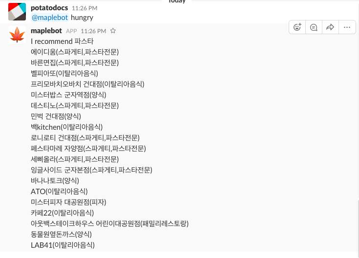

# Project Topic
A python-powered Slack-bot

# What is Slackbot?
Slackbot is always willing to help, whether that's through direct message or in a channel with your teammates. Here are some ways you might use Slackbot:

* To find answers to your questions about Slack.
* To add customized automatic responses.
* To access personal reminders and tasks.

# Maplebot
Maplebot is working on [https://maplestoryworkspace.slack.com.] by the team maplestory

# Function

1) Hungry

 This function is a random function of our lunch menus, which are always our worries. It randomly selects one of the pre-made menus and searches for restaurants around Sejong University from [https://www.naver.com], using crawling technique.If you want this function, please enter ' hungry '!
 

  

 

2) Schedule

 This function tells you what the members of ' Maple Story ' are doing now. It will be useful to use this function when you wish to discuss with your team about the project now. If you want to use this function, type ' Schedule '.

3) Weather

 Having trouble choosing what to wear every morning? Need recommendations on what to wear according to the temperature?
 Type in 'Weather'.
 You will get a reply that will help you decide on your clothings for today's weather!
